# Historical Property Report: 95 School House Rd, Phillipston, MA 01331

**Coordinates:** 42.6021368, -72.1510155
**County:** Worcester County, Massachusetts
**Parcel Viewer:** [Phillipston AxisGIS](https://www.axisgis.com/phillipstonma/)
**Report Date:** March 9, 2026

---

## Table of Contents

1. [Land & Geology](#land--geology)
2. [Indigenous History](#indigenous-history)
3. [Colonial Settlement](#colonial-settlement)
4. [Agricultural & Industrial Era](#agricultural--industrial-era)
5. [Modern Era](#modern-era)
6. [Environmental Profile](#environmental-profile)
7. [Historical Timeline](#historical-timeline)
8. [Maps & Imagery Appendix](#maps--imagery-appendix)
9. [Interactive Viewers & Sources](#interactive-viewers--sources)

---

## Land & Geology

### Geographic Setting

Phillipston sits in the **central Massachusetts highlands**, a rugged, elevated plateau in northern Worcester County. The town occupies 24.6 square miles (24.3 sq mi land, 0.4 sq mi water) at an approximate elevation of **1,166 feet** above sea level, making it one of the higher-elevation communities in the region. The property at 95 School House Rd is located within this upland terrain, bisected by Route 2. The town is bordered by Petersham (southwest), Athol (northwest), Royalston (north), Templeton (east), Hubbardston (southeast), and Barre (south).

### Bedrock & Surficial Geology

The underlying bedrock consists primarily of **gneiss and schist**, metamorphic rocks typical of the central New England highlands. These formations were laid down hundreds of millions of years ago and subsequently deformed through multiple episodes of mountain-building.

The surficial geology is dominated by **glacial till** -- a heterogeneous mixture of sand, gravel, boulders, and compacted clay deposited by the Laurentide Ice Sheet during the **Wisconsinan glaciation**. At its maximum extent approximately 22,000 years ago, the ice sheet was an estimated 2,000 feet thick over nearby Worcester. As the glacier retreated, it shed a blanket of till 10-15 feet thick across the uplands, draping over the polished and scratched bedrock surface.

The region also contains deposits of **sand and gravel** in valleys and outwash plains, characteristic of meltwater channels that formed during glacial retreat. The glacial till in this area is notably **acidic** due to the weathering of sulfidic schists in the bedrock, providing little natural buffering against acid deposition.

### Terrain & Soils

The landscape is characterized by **hilly, forested terrain** with numerous glacial erratic boulders, rocky outcrops, and poorly drained depressions. The soils derive from the underlying glacial till and tend to be stony, moderately well-drained upland soils typical of New England forest cover. The SSURGO soil survey map below shows the distribution of soil map units across the area.

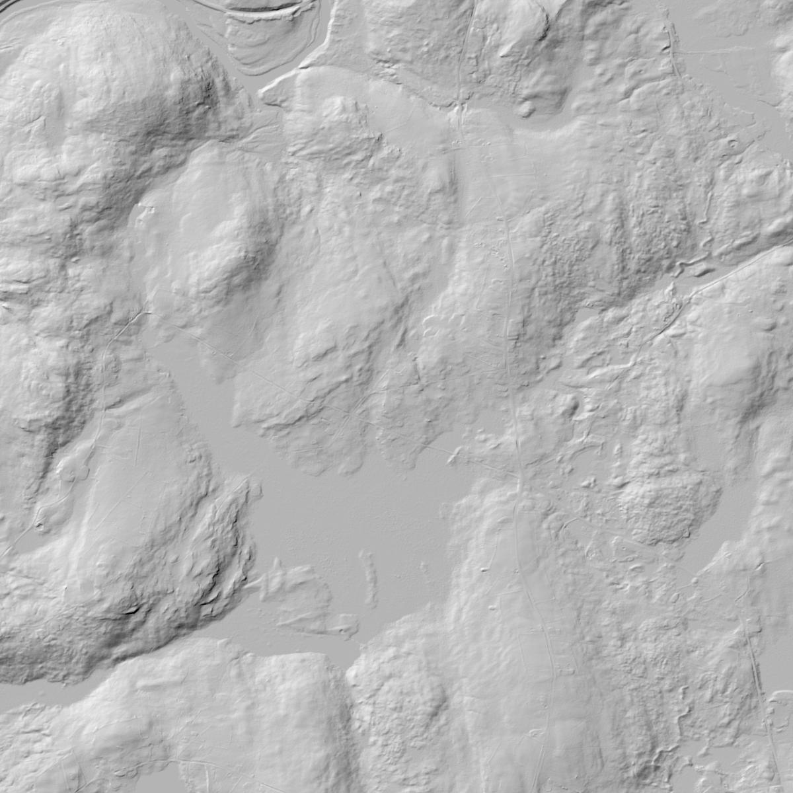
*LiDAR-derived hillshade showing terrain relief around 95 School House Rd. Note the rolling, hilly topography characteristic of the central Massachusetts highlands.*

*3DEP elevation data for the area. Lighter values indicate higher elevations.*

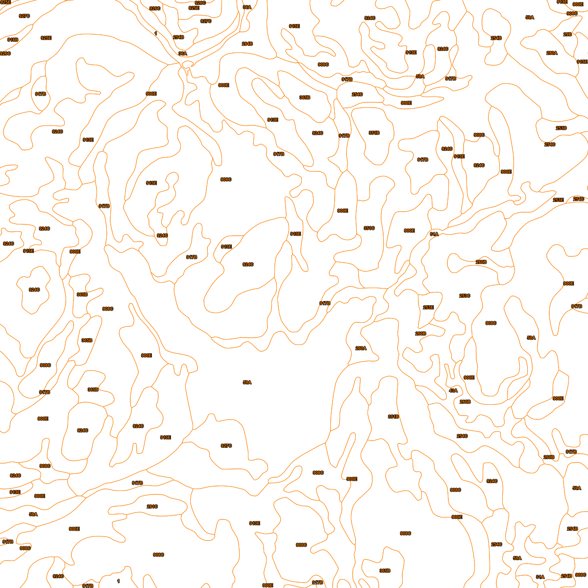
*USDA SSURGO soil map units. Different colors represent distinct soil series with varying drainage, depth, and composition characteristics.*

---

## Indigenous History

### The Nipmuc People

The land that became Phillipston is part of **Nippenet** -- "the freshwater pond place" -- the ancestral territory of the **Nipmuc** (also Nipnet, Nipmuck) people. The Nipmuc homeland encompassed the central plateau of Massachusetts, extending into parts of Connecticut and Rhode Island. At the time of European contact in the early 17th century, an estimated **5,000 to 6,000 Nipmuc** inhabited this territory.

The Nipmuc lived primarily along the rivers and streams connected to the Blackstone, Quaboag, Nashua, Assabet, and Quinebaug waterways. They subsisted through a mixed economy of **planting, hunting, and gathering**. Women were the keepers of cultural traditions, responsible for farming and feeding their families, while also passing knowledge from one generation to the next.

### European Contact & Conflict

The first documented contact between the Nipmuc and Europeans occurred in **1630**, when the Nipmuc provided corn to starving colonists in Boston. However, the colonial authorities soon encouraged settlers to wage war on the Nipmuc people, destroying native villages by burning homes, trampling gardens, and killing women and children.

The defining conflict was **King Philip's War (1675-1676)**, the deadliest war per capita in colonial American history. Many Nipmuc joined **Metacom** (who had taken the English name "King Philip") against the English settlers. The war devastated both sides, but its aftermath was catastrophic for indigenous peoples across New England. The conflict occurred approximately 75 years before European settlement reached Phillipston.

### Continuing Presence

Nearly **600 members** of the Nipmuc tribe live in Massachusetts today. The four-and-a-half-acre **Hassanamisco Reservation** and Cisco Homestead in Grafton have been continuously controlled by the Nipmuc people since the mid-1600s, representing the longest continuously held Native American land in Massachusetts.

---

## Colonial Settlement

### First Settlement (1751)

Phillipston was **first settled in 1751**, carved from the western section of Templeton and the eastern section of Athol. The settlement was driven in part by practical ecclesiastical concerns -- the remote western residents of Templeton found it difficult to travel to the meetinghouse for required church attendance, so establishing a separate community solved this civic-religious problem.

### Incorporation as "Gerry" (1786)

On **October 20, 1786**, the settlement was officially incorporated as the town of **Gerry**, named after **Elbridge Gerry**, a signer of the Declaration of Independence and prominent Massachusetts politician. Gerry would go on to become Governor of Massachusetts (1810-1812) and Vice President of the United States (1813-1814), but his legacy was controversial -- he is best known for the political practice of "gerrymandering," named after his manipulation of electoral districts.

### Renaming to Phillipston (1814)

On **February 5, 1814**, the town petitioned the court to change its name, citing "disapprobation of his measures when Governor of the State, especially a law for districting the state for the choice of senators" -- the very gerrymandering that would make Gerry infamous. The town was renamed **Phillipston** in honor of **William Phillips Jr.** (1750-1827), a Boston merchant, politician, and philanthropist who served as the **tenth Lieutenant Governor of Massachusetts** from 1812 to 1823. The Phillips family was "long distinguished for its wealth and its munificence."

### Early Religious Life

In **1785**, a church was gathered under the direction of the ecclesiastical council. In **1788**, Rev. Ebenezer Tucker was ordained as pastor. The establishment of the church and meetinghouse formed the social and geographic center of the community, around which the Phillipston Center Historic District would develop.

---

## Agricultural & Industrial Era

### Agricultural Character

The soils of the area, while rocky, were favorable enough for **growing crops and grazing cattle**, and Phillipston developed as a **dispersed agricultural community**. The landscape of the period was characterized by open fields, pastures, and the ubiquitous **stone walls** that farmers built from glacial stones cleared from fields -- many of which still trace their lines through the now-forested landscape.

The town's population reflected its agricultural fortunes:
- **1790s-1850:** Growth period, population reaching **809** by 1850
- **1850-1920:** Steady decline as farming shifted westward, bottoming at **354** in 1920
- A common pattern across the New England hill towns as younger generations migrated to industrial cities or the expanding western frontier

### Stone Walls & Land Use Change

The extensive stone wall networks visible throughout Phillipston -- including in wooded areas -- tell a clear story of land use transformation. Fields that were once open pasture and cropland were gradually **abandoned and reforested** beginning in the mid-19th century. The Elliott Laurel Reservation, now a 33-acre woodland preserve managed by The Trustees of Reservations since 1941, was once **open pastureland**. Today it is traversed by old stone walls beneath a canopy of woodland, with notable stands of mountain laurel.

### Key Institutions

- **Phillips Free Public Library**: Established **1860**, reflecting the Phillips family's philanthropic legacy
- **Phillipston Center Historic District**: Listed on the **National Register of Historic Places in 1999**, preserving the civic and religious heart of the town
- **Searles Hill Cemetery**: Listed on the **National Register of Historic Places in 2011**

---

## Modern Era

### Population Recovery

After reaching a nadir of 354 residents in 1920, Phillipston experienced a dramatic recovery in the latter half of the 20th century, driven by the automobile era and appeal of rural living within commuting distance of regional employment centers:

| Census Year | Population | Change |
|-------------|-----------|--------|
| 1850 | 809 | -- |
| 1920 | 354 | Historic low |
| 1970 | 872 | Recovery begins |
| 2000 | 1,621 | +86% since 1970 |
| 2010 | 1,682 | +3.8% |
| 2020 | 1,724 | +2.5% |

### Demographics & Character

Phillipston remains a **small, rural, predominantly white community** (97.5% White, per recent census data) with a median age of 48.2 -- approximately 20% higher than the Worcester County average. The **median household income** is $92,027 (2023), with per capita income of $41,239.

The town is governed by **open town meeting** and belongs to the **Narragansett Regional School District** (shared with Templeton). The former Phillipston Memorial School has closed; students attend schools in Templeton.

Phillipston is described as "quite a bit more rural than neighboring towns like Templeton," attracting residents seeking "large lots with privacy and not a lot of neighbors." The landscape is marked by **forests, winding roads, and historic stone walls**, serving as the **northern entrance to the Quabbin Reservoir**.

### Notable Residents

- **Charlotte Barnum** -- mathematician
- **Thomas H. White** -- industrialist

---

## Environmental Profile

### Quabbin Watershed Connection

Phillipston occupies a critical position as the **northern gateway to the Quabbin Reservoir**, the primary public drinking water supply for over **2.5 million Massachusetts residents**. The Quabbin watershed ecosystem is managed by the Massachusetts Department of Conservation and Recreation (DCR) Office of Watershed Management under federal and state water quality regulations.

### Forest Ecology

The surrounding landscape is **almost exclusively high-canopy, unfragmented mixed forest** on steep, hilly terrain. Habitat types include:
- Northern hardwood forest
- Oak-conifer forest
- Conifer forest
- Early successional shrubland
- Emergent freshwater marsh
- Shrub-scrub wetland
- Lake/pond and river/stream corridors

The area holds significant populations of **interior forest-breeding birds**, including documented breeding populations of:
- **Common Loon** (breeding since the 1980s)
- **Bald Eagle** (breeding since the 1980s)
- **Pied-billed Grebe** (confirmed 2000)

Species of special concern include the **Wood Turtle** and **Triangle Floater** (a freshwater mussel).

### Conservation Lands

The **Phillipston Wildlife Management Area** provides critical habitat, and conservation efforts by organizations like **Mount Grace Land Conservation Trust** have focused on creating connected forest corridors that prevent barriers to native species movement. The **Quabbin to Wachusett Forest Legacy Project** has conserved thousands of acres across six towns.

### Environmental Concerns

- **Invasive species**: The DCR has identified the expansion of non-native invasive species as a potential threat to the Quabbin watershed landscape
- **Acid deposition**: The acidic glacial till derived from sulfidic schists provides minimal natural buffering against acid rain
- **Development pressure**: While still rural, the population doubling since 1970 reflects ongoing development in what was historically remote forest and farmland

### Flood & Hydrology

The FEMA flood zone map and NHD hydrology layers below show watercourses and flood-prone areas near the property.

*FEMA National Flood Hazard Layer. Areas in blue indicate special flood hazard zones (100-year floodplain).*

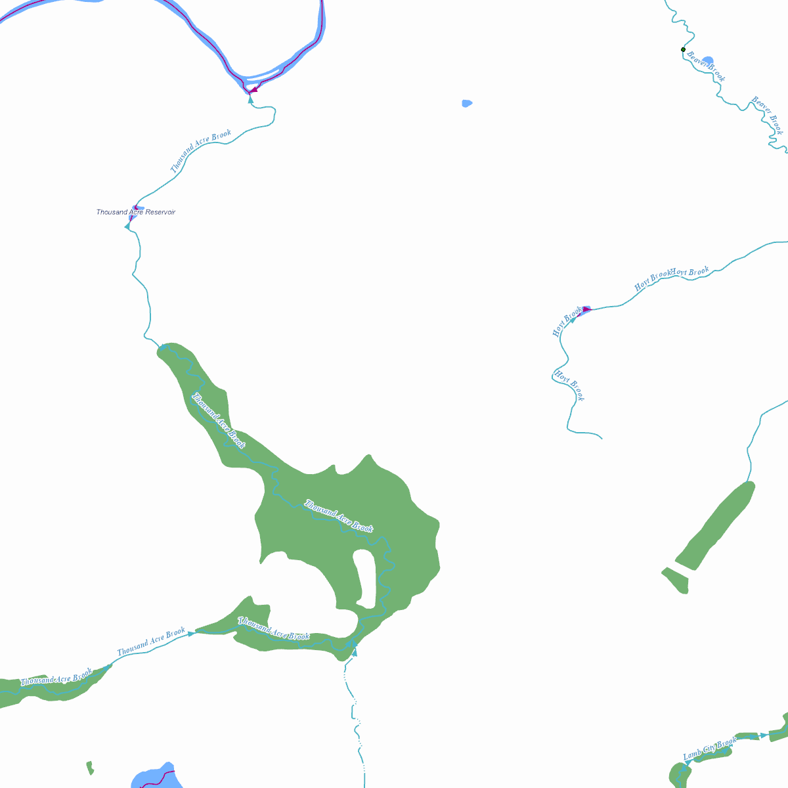
*National Hydrography Dataset showing streams, rivers, and water bodies in the area.*

*National Wetlands Inventory. Mapped wetland areas shown in color.*

### Land Cover & Soils

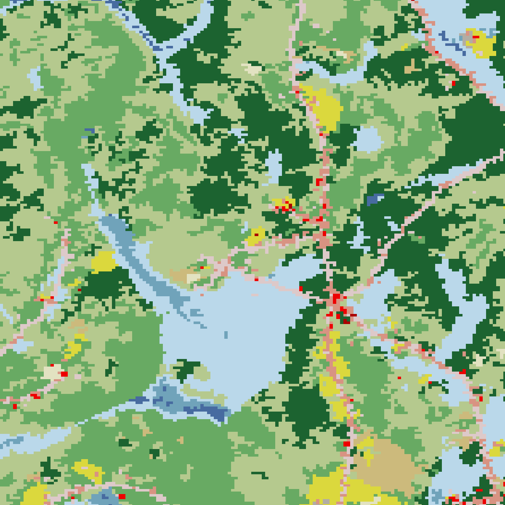
*NLCD 2021 Land Cover classification. Green shades indicate forest types; other colors show developed, agricultural, or wetland areas.*

---

## Historical Timeline

| Year | Event |
|------|-------|
| ~22,000 BP | Laurentide Ice Sheet reaches maximum extent; ~2,000 ft thick over Worcester County |
| ~15,000 BP | Glacial retreat; till deposits blanket the uplands |
| Pre-1620 | Nipmuc people inhabit Nippenet; estimated 5,000-6,000 population |
| 1630 | First documented Nipmuc-European contact; Nipmuc provide corn to Boston colonists |
| 1675-1676 | King Philip's War devastates Native American communities across New England |
| 1751 | First European settlement in what becomes Phillipston |
| 1785 | Church gathered under direction of ecclesiastical council |
| 1786 | Town incorporated as **Gerry** (October 20), named for Elbridge Gerry |
| 1788 | Rev. Ebenezer Tucker ordained as first pastor |
| 1814 | Town renamed **Phillipston** (February 5), honoring Lt. Gov. William Phillips Jr. |
| 1850 | Population reaches 809 |
| 1860 | Phillips Free Public Library established |
| 1887 | First USGS topographic survey of the area (Winchendon quadrangle, 1:62,500) |
| 1920 | Population reaches historic low of 354 |
| 1939 | Quabbin Reservoir begins filling (completed 1946), transforming the regional landscape |
| 1941 | Elliott Laurel donated to The Trustees of Reservations |
| 1970 | Population recovery: 872 residents |
| 1999 | Phillipston Center Historic District listed on National Register of Historic Places |
| 2000 | Population reaches 1,621 |
| 2011 | Searles Hill Cemetery listed on National Register of Historic Places |
| 2020 | Population: 1,724 |

---

## Maps & Imagery Appendix

### Satellite Imagery

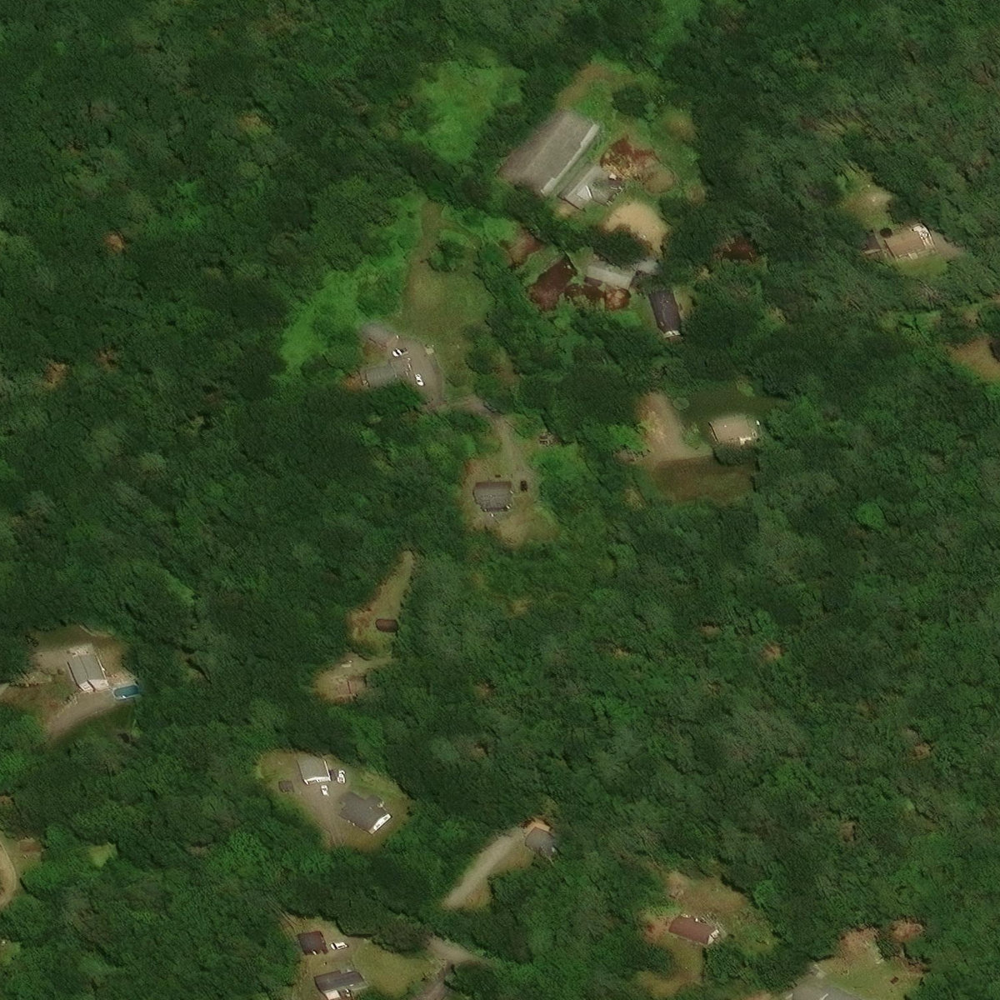
*ESRI World Imagery -- close-up view centered on 95 School House Rd. Shows the parcel and immediate surroundings.*

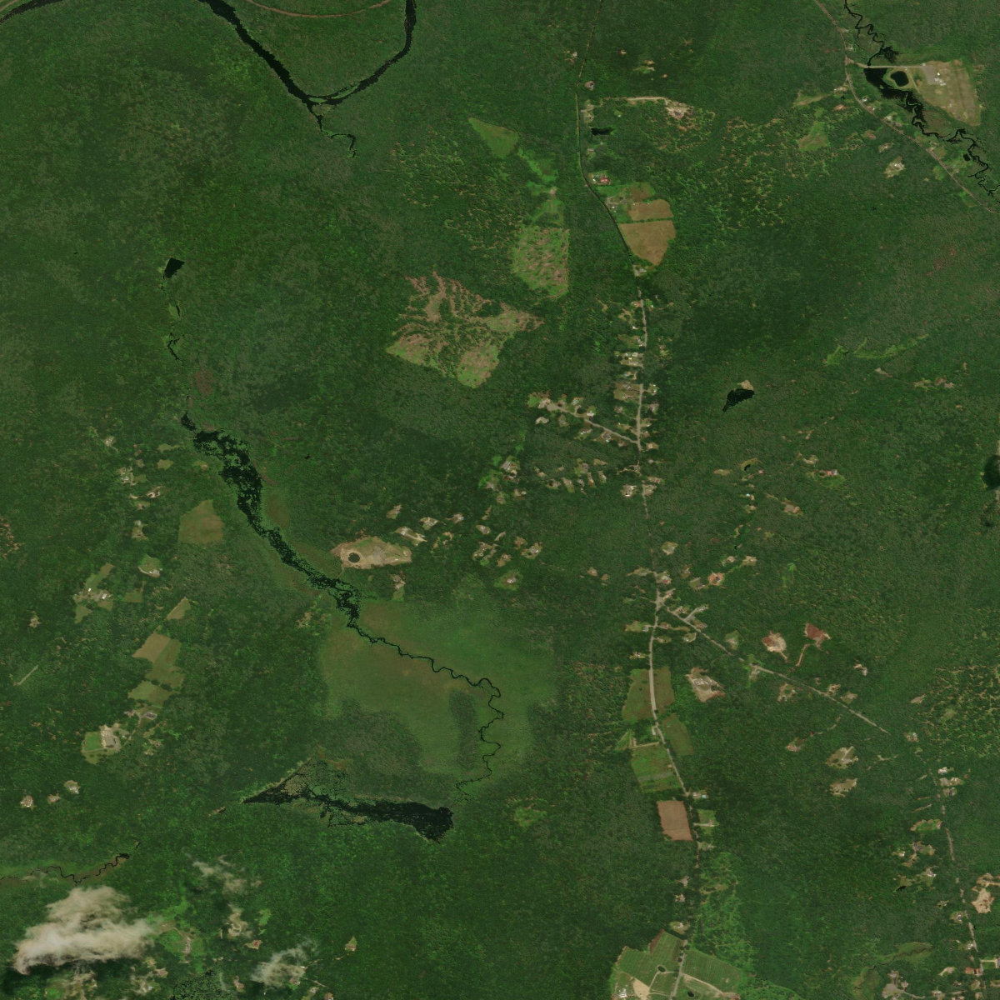
*ESRI World Imagery -- area view showing Phillipston and surrounding terrain.*

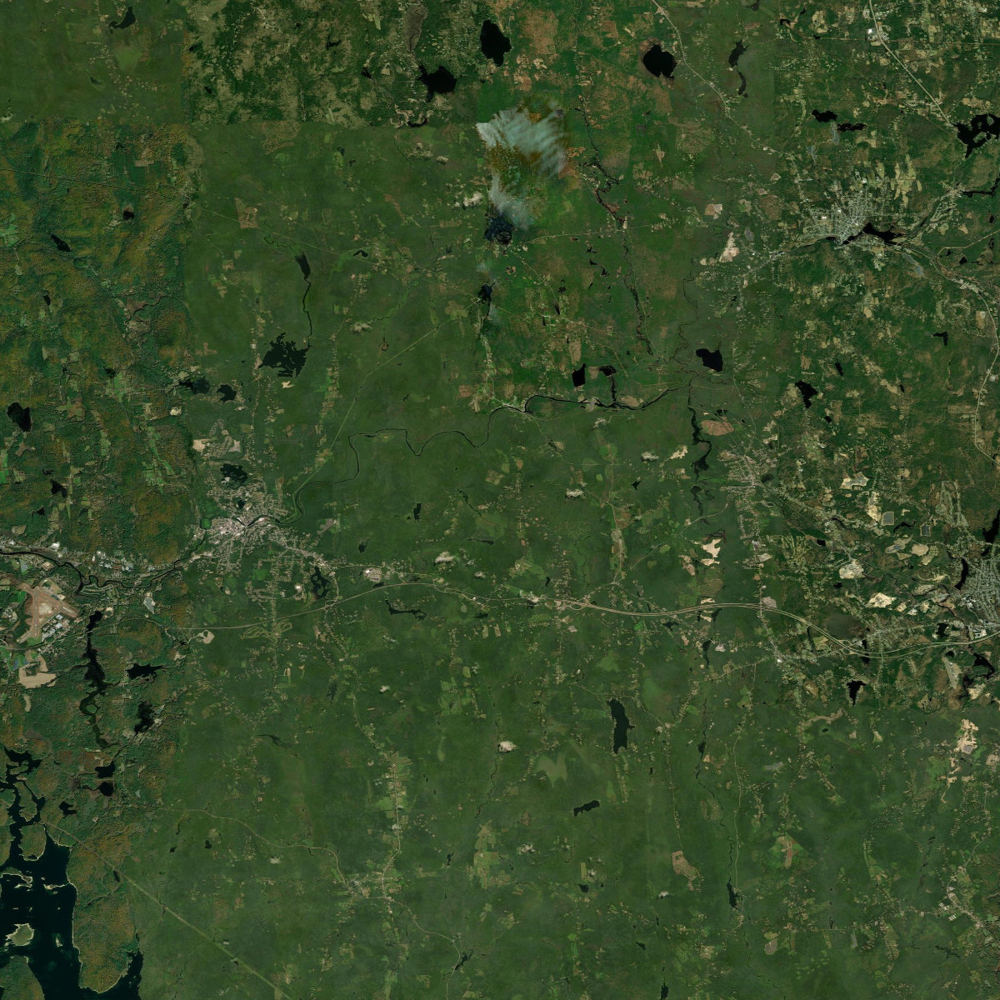
*ESRI World Imagery -- wide regional view showing Phillipston's position in the central Massachusetts highlands.*

### Aerial Photography

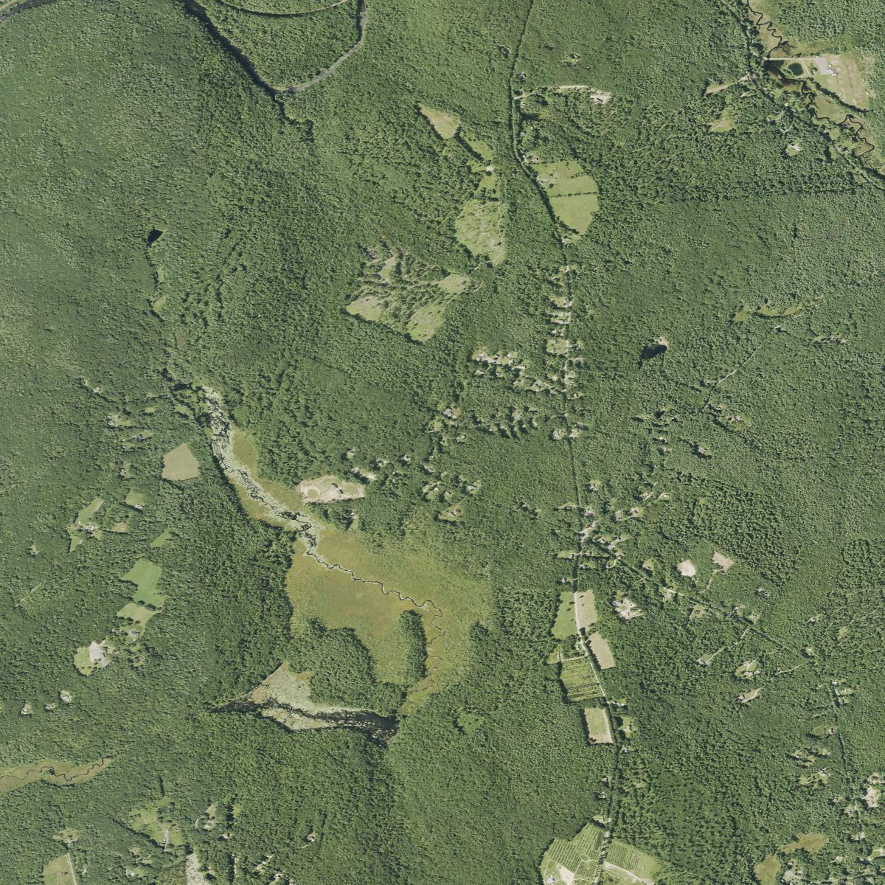
*USGS NAIP (National Agriculture Imagery Program) aerial photograph. High-resolution natural-color imagery captured during growing season.*

### Terrain & Elevation

*USGS 3DEP LiDAR-derived hillshade. Reveals topographic features including ridges, valleys, and drainage patterns.*

*USGS 3DEP raw elevation data. Lighter tones = higher elevation.*

### Reference Maps

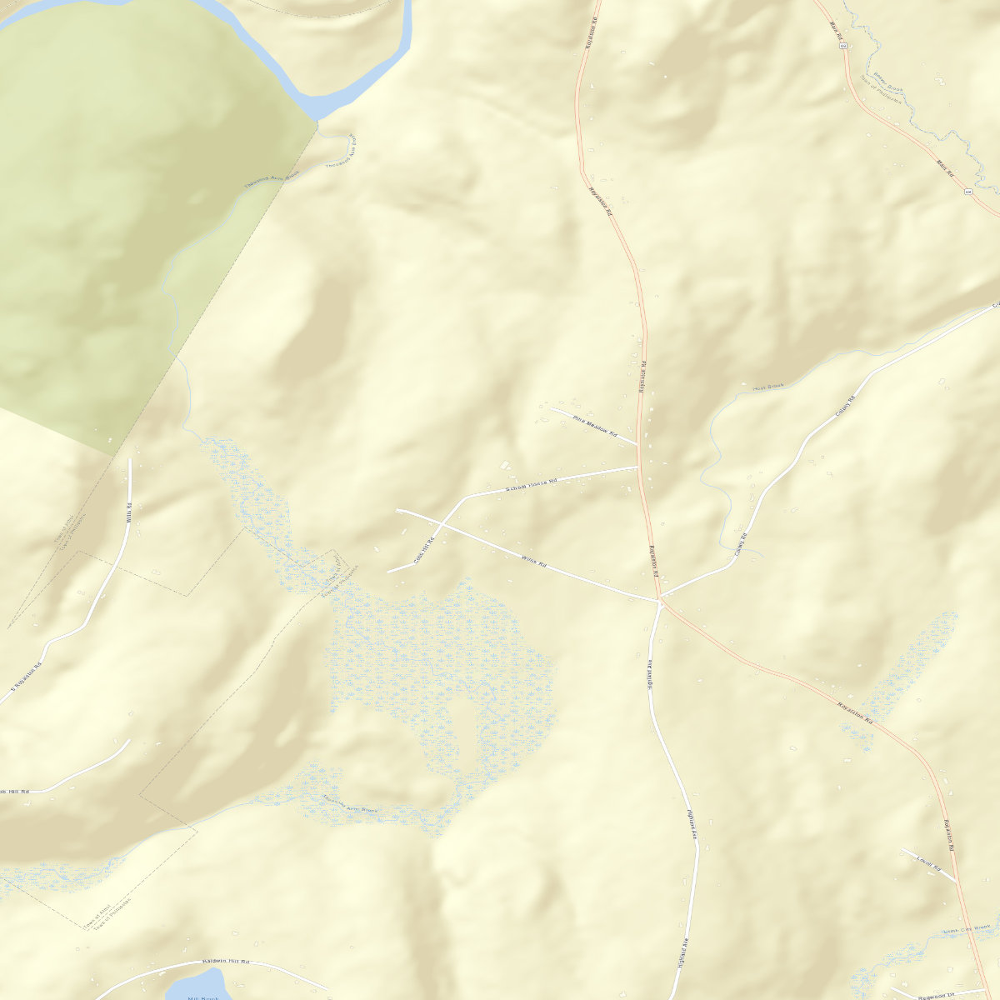
*ESRI World Street Map showing road network, place names, and municipal boundaries.*

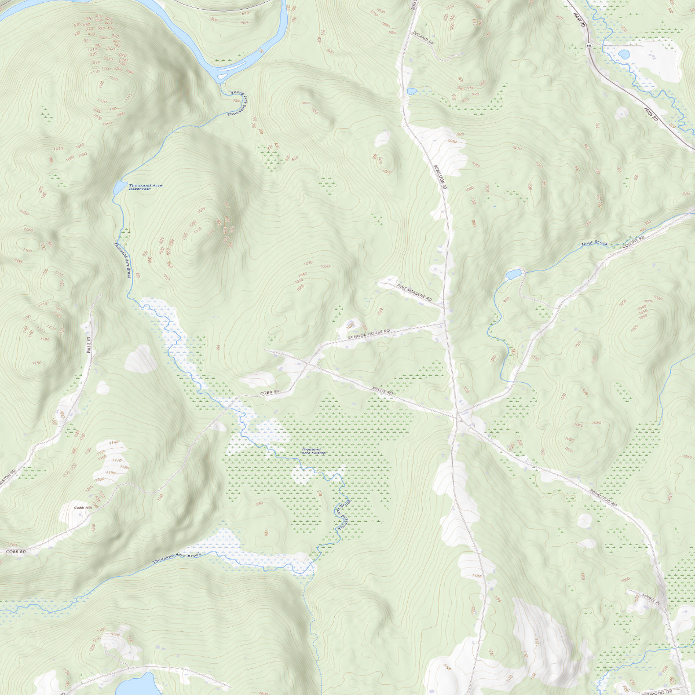
*USGS current topographic map (US Topo series). Shows contour lines, roads, water features, and land cover.*

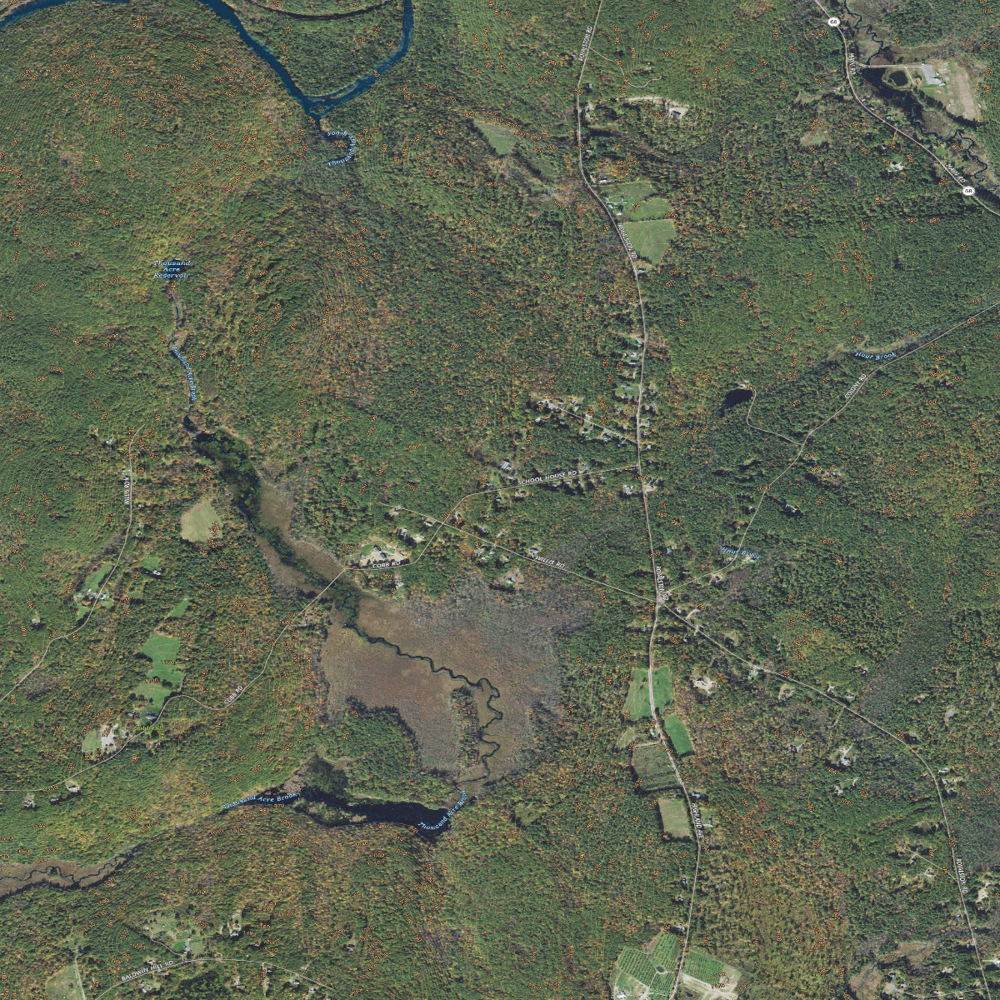
*USGS Imagery + Topo hybrid overlay. Satellite imagery with topographic annotations.*

### Environmental Layers

*FEMA National Flood Hazard Layer (NFHL). Flood zone designations for the area.*

*National Hydrography Dataset (NHD). Streams, rivers, ponds, and watershed boundaries.*

*National Wetlands Inventory (NWI). Classified wetland areas.*

*National Land Cover Database (NLCD) 2021. Land use/land cover classification.*

*USDA SSURGO soil survey map units. Soil type boundaries and classifications.*

### Historical Topographic Maps (Available via USGS TNM)

The following historical topographic maps cover the Phillipston area and are available for download from the USGS National Map:

| Year | Map Name | Scale | Download |
|------|----------|-------|----------|
| 1887 | Winchendon, MA | 1:62,500 | [GeoPDF](https://prd-tnm.s3.amazonaws.com/StagedProducts/Maps/HistoricalTopo/PDF/MA/62500/MA_Winchendon_463117_1887_62500_geo.pdf) |
| 1890 | Winchendon, MA | 1:62,500 | [GeoPDF](https://prd-tnm.s3.amazonaws.com/StagedProducts/Maps/HistoricalTopo/PDF/MA/62500/MA_Winchendon_353120_1890_62500_geo.pdf) |
| 1894 | Winchendon, MA | 1:62,500 | [GeoPDF](https://prd-tnm.s3.amazonaws.com/StagedProducts/Maps/HistoricalTopo/PDF/MA/62500/MA_Winchendon_353125_1894_62500_geo.pdf) |
| 1935 | Winchendon, MA | 1:62,500 | [GeoPDF](https://prd-tnm.s3.amazonaws.com/StagedProducts/Maps/HistoricalTopo/PDF/MA/62500/MA_Winchendon_353113_1935_62500_geo.pdf) |
| 1946 | Athol, MA | 1:31,680 | Available via [TNM](https://apps.nationalmap.gov/downloader/) |
| 1954 | Athol, MA | 1:24,000 | Available via [TNM](https://apps.nationalmap.gov/downloader/) |
| 1970 | Athol, MA | 1:24,000 | Available via [TNM](https://apps.nationalmap.gov/downloader/) |
| 1975 | Athol, MA | 1:25,000 | Available via [TNM](https://apps.nationalmap.gov/downloader/) |
| 1988 | Athol, MA | 1:25,000 | Available via [TNM](https://apps.nationalmap.gov/downloader/) |

---

## Interactive Viewers & Sources

### Interactive Map Viewers

- **USGS National Map Viewer**: [https://apps.nationalmap.gov/viewer/](https://apps.nationalmap.gov/viewer/) -- View topo maps, aerial imagery, elevation, hydrography
- **USGS Historical Topo Map Explorer**: [https://livingatlas.arcgis.com/topoexplorer/](https://livingatlas.arcgis.com/topoexplorer/) -- Browse historical USGS quadrangles by year
- **FEMA Flood Map Service Center**: [https://msc.fema.gov/portal/search](https://msc.fema.gov/portal/search) -- Official flood zone determinations
- **NWI Wetlands Mapper**: [https://fwsprimary.wim.usgs.gov/wetlands/apps/wetlands-mapper/](https://fwsprimary.wim.usgs.gov/wetlands/apps/wetlands-mapper/) -- Interactive wetland mapping
- **Web Soil Survey**: [https://websoilsurvey.nrcs.usda.gov/](https://websoilsurvey.nrcs.usda.gov/) -- Detailed soil reports for any parcel
- **NLCD Viewer**: [https://www.mrlc.gov/viewer/](https://www.mrlc.gov/viewer/) -- Land cover change over time
- **Phillipston AxisGIS Parcel Viewer**: [https://www.axisgis.com/phillipstonma/](https://www.axisgis.com/phillipstonma/) -- Town parcel data, assessor records
- **MassGIS Property Tax Parcels**: [https://gis.data.mass.gov/](https://gis.data.mass.gov/) -- Statewide parcel data
- **Heritage Landscape Atlas**: [https://www.mass.gov/info-details/heritage-landscape-atlas](https://www.mass.gov/info-details/heritage-landscape-atlas)
- **MACRIS (MA Cultural Resource Information System)**: [https://mhc-macris.net/](https://mhc-macris.net/)

### Research Sources

- [Phillipston, MA -- Wikipedia](https://en.wikipedia.org/wiki/Phillipston,_Massachusetts)
- [About Phillipston -- Town Website](https://www.phillipston-ma.gov/about-phillipston)
- [Phillipston Heritage Reconnaissance Report (PDF) -- Mass.gov](https://www.mass.gov/files/documents/2016/08/sw/philipston.pdf)
- [Nipmuc Nation History -- UMass](https://www.umass.edu/nativetrails/nations/Nipmuc/history.html)
- [Worcester and the Nipmucs -- UUC Worcester](https://www.uucworcester.org/worcester-and-the-nipmucs/)
- [Hassanamisco Indian Museum](https://www.nipmucmuseum.org/history/)
- [Quabbin Reservoir Watershed IBA -- Mass Audubon](https://www.massaudubon.org/our-conservation-work/wildlife-research-conservation/bird-conservation-monitoring/massachusetts-important-bird-areas-iba/iba-sites/quabbin-reservoir-watershed)
- [Mount Grace Land Conservation Trust](https://www.mountgrace.org/)
- [Elliott Laurel -- The Trustees](https://thetrustees.org/place/elliott-laurel/)
- [Historical Society of Phillipston](https://masshistorycommons.org/project/historical-society-of-phillipston/)
- [Millers River Watershed Council -- Natural History](https://millerswatershed.org/natural-history/)
- [Geologic Units in Worcester County -- USGS](https://mrdata.usgs.gov/geology/state/fips-unit.php?code=f25027)
- [Census Reporter -- Phillipston](http://censusreporter.org/profiles/06000US2502753225-phillipston-town-worcester-county-ma/)
- [William Phillips Jr. -- Wikipedia](https://en.wikipedia.org/wiki/William_Phillips_Jr.)

---

*Report compiled March 9, 2026. Map imagery sourced from ESRI, USGS, FEMA, USFWS, USDA NRCS, and MRLC. All images represent publicly available geospatial data layers.*
